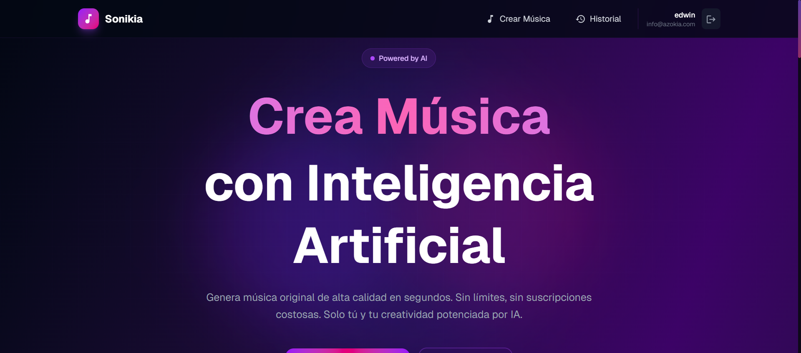

<!-- Hero -->
<h1 align="center">🎵 Sonikia · Generación de música con IA</h1>

<p align="center">
  <b>Vibe developer</b> · <b>Edwin Estrella</b> · Diseño & producto digital
</p>

<p align="center">
  
</p>

<h3 align="center">
  Interfaces premium · Audio en tiempo real · Backend con InsForge & MusicGPT
</h3>

<p align="center">
  <b>“La música es arquitectura en el tiempo.”</b>
</p>

---

### 👋 Sobre el proyecto

- 🎹 **Sonikia** es una app web para crear música con IA usando la **MusicGPT API**, con UI oscura, animaciones y flujo de generación → reproducción → descarga.
- 🔐 **Cuentas e historial** respaldados por **InsForge** (auth, base de datos y almacenamiento cuando aplica).
- ⚡ Enfoque en **baja fricción**, feedback visual claro y código **TypeScript** mantenible.
- 📫 Contacto: **[info@azokia.com](mailto:info@azokia.com)**

---

### ✨ Características

- Generación guiada por prompt (incluye modo instrumental y manejo de letras cuando la API las devuelve).
- Reproductor integrado, descarga en MP3 y estados de carga con progreso.
- Historial por usuario (RLS) y rutas API con sesión/JWT según la configuración del proyecto.
- Diseño responsive, glassmorphism y microinteracciones (Framer Motion, MUI donde corresponde).


### 🛠 Stack & herramientas

 &ensp; **Con qué está construido**

<br/>

[](https://skillicons.dev)

<p align="center">
  <sub>También: <b>@insforge/sdk</b>, <b>MusicGPT API</b>, <b>MUI</b>, <b>Framer Motion</b></sub>
</p>

---

### 📋 Requisitos

- **Node.js** ≥ 20.9
- Cuenta / API key de **MusicGPT** ([api.musicgpt.com](https://api.musicgpt.com/))
- Proyecto **InsForge** (URL + anon key) si usas auth, historial y guardado en backend

### ⚙️ Instalación

```bash
git clone <tu-repo>
cd sonikia
npm install
```

Crea `.env.local` en la raíz:

```env
# MusicGPT
MUSICGPT_API_KEY=tu_api_key
MUSICGPT_BASE_URL=https://api.musicgpt.com/api/public

# InsForge (frontend + API routes)
NEXT_PUBLIC_INSFORGE_BASE_URL=https://tu-app.region.insforge.app
NEXT_PUBLIC_INSFORGE_ANON_KEY=tu_anon_key
```

### 🎬 Scripts

| Comando        | Descripción        |
| -------------- | ------------------ |
| `npm run dev`  | Desarrollo         |
| `npm run build` | Build producción  |
| `npm start`    | Servidor producción |
| `npm run lint` | ESLint             |

Abre [http://localhost:3000](http://localhost:3000).

---

### 📁 Estructura (resumen)

```
sonikia/
├── app/                 # App Router, páginas y API routes
├── components/          # UI (generador, estados, layout)
├── contexts/            # Auth / estado global cliente
├── hooks/               # useMusicGeneration, etc.
├── lib/                 # InsForge, sesión, helpers API
├── types/               # Tipos MusicGPT y dominio
└── docs/                # Capturas y documentación visual
```

---

### 🚀 En lo que me enfoco

- Productos con **UX clara** y rendimiento aceptable en red lenta.
- Integraciones **API + auth** sin filtrar secretos al cliente.
- Código **tipado**, separación cliente/servidor y manejo de errores legible para el usuario.

---

### 📄 Licencia

MIT — ver uso responsable de claves y cuotas de terceros (MusicGPT / InsForge).

### 💌 Contacto

<p>
  <a href="mailto:info@azokia.com">
    
  </a>
</p>

<p align="center">
  <sub>Hecho con 🎧 por <b>Edwin Estrella</b></sub>
</p>
